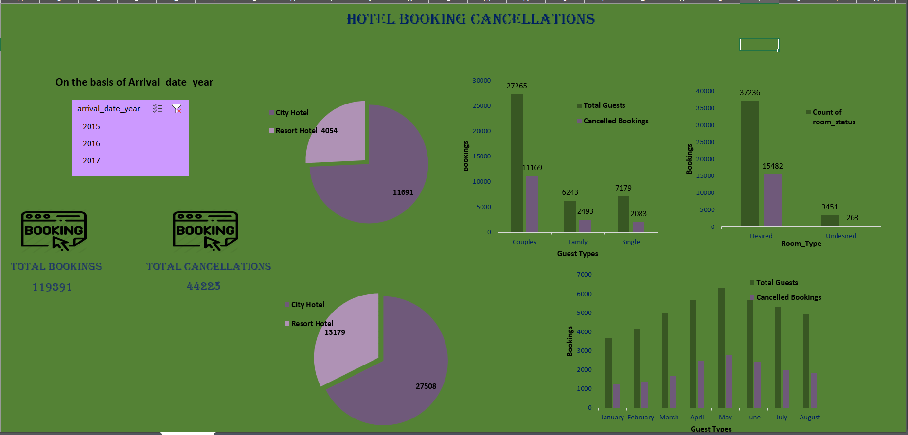

# 🏨 Hotel Booking Data Analysis

## 📌 Project Overview

This project focuses on analyzing hotel booking data using Microsoft Excel to identify booking trends, cancellation patterns, customer behavior, and other important business insights.

## 🎯 Objectives

* Analyze hotel booking trends
* Understand booking and cancellation patterns
* Identify customer preferences
* Analyze revenue-related trends
* Create meaningful insights using Excel

## 🛠️ Tools Used

* Microsoft Excel
* Pivot Tables
* Pivot Charts
* Excel Formulas
* Data Cleaning
* Data Visualization
* Conditional Formatting

## 📊 Key Analysis

The project includes analysis of:

* Hotel bookings
* Booking cancellations
* Customer types
* Room preferences
* Average Daily Rate (ADR)
* Lead time
* Length of stay
* Market segments
* Monthly booking trends

## 📈 Dashboard

An interactive Excel dashboard was created to present the key findings and make the analysis easy to understand.

## 📂 Project File

📊 [Download Excel Analysis File](./Hotel_booking_data_analysis.xlsx)

## 💡 Key Insights

The analysis helps understand booking patterns, customer behavior, cancellation trends, and factors affecting hotel bookings.

## 🚀 Project Outcome

This project demonstrates practical skills in data cleaning, data analysis, Excel dashboards, Pivot Tables, and data visualization.

## 👩‍💻 Author

**Kashish Pal**
